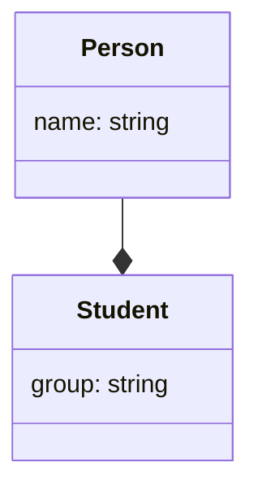
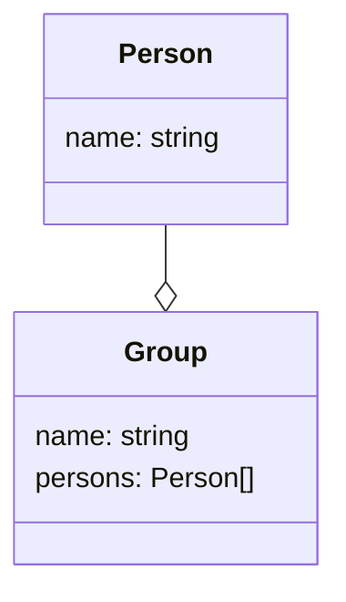
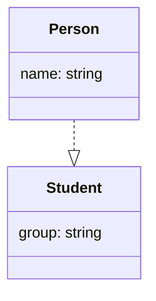
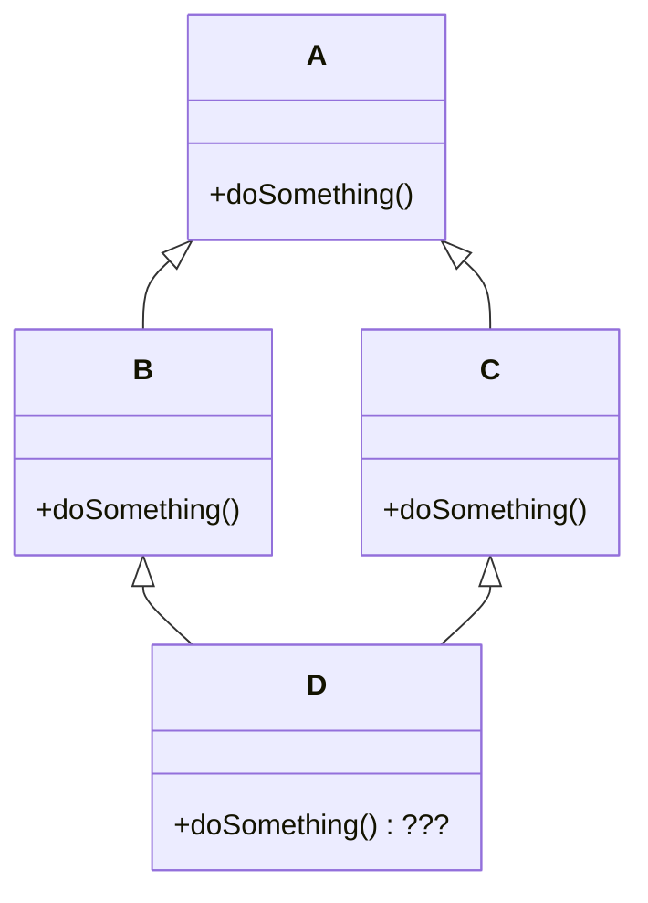

# Отношения классов

---

# О чем речь

- Функции разбивают код на части (структурное программирование)
- Объекты связывают методы и свойства (объектно-ориентированное программирование).
- Классы и типы позволяют структурировать объекты.

Абстрактные понятия над классами (отношения между классами, обобщения и др.) позволяют структурировать и повторно использовать код в классах.

---

# Композиция

```ts {monaco-run}
class Person {
  constructor(public name: string) {}
  public toString = () => `${this.name}`;
}
class Student {
  person: Person;
  constructor(name: string, public group: string) {
    this.person = new Person(name);
  }
  public toString = () => `${this.person}, гр. ${this.group}`;
}

const ivan = new Student("Иван", "22з");
console.log(`${ivan}`);
```

---

# Агрегация

```ts {monaco-run}
class Person {
  constructor(public name: string) {}
  public toString = () => `${this.name}`;
}
class Group {
  persons: Person[] = [];
  constructor(public name: string) {}
  public toString = () => {
    const p = this.persons.map((p) => p.toString()).join(", ");
    return `Группа ${this.name}: ${p}`;
  };
}

const ivan = new Person("Иван");
const petr = new Person("Петр");
const group = new Group("22з");
group.persons.push(ivan);
console.log(`${group}`);
```

---

# Ассоциация

<div class="grid grid-cols-2 gap-4">
<div class="flex justify-center">
<h3>Композиция</h3>
</div>
<div class="flex justify-center">
<h3>Агрегация</h3>
</div>
</div>

<div class="grid grid-cols-2 gap-4">
<div class="flex justify-center">

</div>
<div class="flex justify-center">

</div>
</div>

---

# Наследование

```ts {monaco-run}
class Person {
  constructor(public name: string) {}
  // public toString = () => `${this.name}`;
}
class Student extends Person {
  constructor(name: string, public group: string) {
    super(name); // !
  }
  // this.name !
  public toString = () => `${this.name}, гр. ${this.group}`;
}
const ivan = new Student("Иван", "22з");
console.log(`${ivan}`);
```

---

# Наследование

<div class="grid grid-cols-2 gap-4">
<div class="flex justify-center">
Наследование классов — это механизм в объектно-ориентированном программировании, при котором один класс (потомок) получает свойства и методы другого класса (родителя), что позволяет повторно использовать код и строить иерархии классов.    
</div>
<div class="flex justify-center">

</div>
</div>

---

# Плюсы композиция против наследования

- Гибкость — объекты независимы и легко заменяются.
- Слабая связанность — компоненты не зависят от реализации других классов.
- Легкость в тестировании — компоненты проще тестировать изолированно.
- Поддержка полиморфизма — через интерфейсы и делегирование.
- Модульность — код более структурирован и понятен.

---

# Плюсы наследования против композиции

- Переиспользование кода — методы и свойства родительского класса используются повторно.
- Логическая структура — понятные иерархии классов.
- Полиморфизм — работа с объектами через общий интерфейс.
- Расширяемость — легко добавлять новые классы-потомки.
- Упрощение кода — общие методы и свойства определяются в базовом классе

---

# Зависимость (реализация)

```ts {monaco-run}
interface Person {
  name: string;
}
class Student implements Person {
  constructor(public name: string, public group: string) {}
  toString = () => `${this.name}, гр. ${this.group}`;
}
const ivan = new Student("Иван", "22з");
console.log(`${ivan}`);
```

---

# Реализация

<div class="grid grid-cols-2 gap-4">
<div class="flex justify-center">
Отношение реализации между классами — это семантическое отношение, при котором один класс (реализующий) выполняет обязательства, определенные другим классом (интерфейсом или абстрактным классом). 
</div>
<div class="flex justify-center">

</div>
</div>

---

# Type или interface?

<style>
  .slidev-layout td {
    padding: 0.3em;
  }
</style>
<table class="text-[0.7em] w-[70%]">
        <thead>
            <tr  >
                <th>Характеристика</th>
                <th><code>interface</code></th>
                <th><code>type</code></th>
            </tr>
        </thead>
        <tbody>
            <tr  >
                <td >Основное назначение</td>
                <td >Описание формы объектов, классов</td>
                <td >Описание любых типов данных</td>
            </tr>
            <tr >
                <td >Расширение</td>
                <td ><code>interface A extends B</code></td>
                <td ><code>type A = B & { ... }</code></td>
            </tr>
            <tr >
                <td >Объединение интерфейсов/типов</td>
                <td >Декларативное слияние (автоматическое объединение)</td>
                <td >Не поддерживается (ошибка при повторном объявлении)</td>
            </tr>
            <tr >
                <td >Применимость</td>
                <td >Только к объектам</td>
                <td >Ко всем типам: примитивы, объединения, кортежи и др.</td>
            </tr>
            <tr >
                <td >Имплементация в классе</td>
                <td ><code>class A implements B</code></td>
                <td >Также поддерживается</td>
            </tr>
            <tr >
                <td >Вычисляемые свойства</td>
                <td >Не поддерживаются</td>
                <td >Поддерживаются (mapped types, conditional types)</td>
            </tr>
            <tr >
                <td >Когда использовать</td>
                <td >API, объекты, классы, расширяемые типы</td>
                <td >Сложные типы, union-типы, кортежи, условные типы</td>
            </tr>
        </tbody>
</table>

---

# Наследование. Переопределение методов.

```ts {monaco-run}
class Person {
  constructor(public name: string) {}
  public toString = () => `${this.name}`;
}
class Student extends Person {
  constructor(name: string, public group: string) {
    super(name); }
  override toString = () => `${this.name}, гр. ${this.group}`;
}
const ivan = new Person("Иван");
const ivan2 = new Student("Иван", "22з");
console.log(`${ivan}`);
console.log(`${ivan2}`);
console.log(`${ivan2.name}`);
```

---

# Наследование. Модификатор protected

```ts {monaco-run}
class Person {
  constructor(protected name: string) {}
  public toString = () => `${this.name}`;
}
class Student extends Person {
  constructor(name: string, public group: string) {
    super(name);
  }
  override toString = () => `${this.name}, гр. ${this.group}`;
}
const ivan = new Person("Иван");
const ivan2 = new Student("Иван", "22з");
console.log(`${ivan}`);
console.log(`${ivan2}`);
console.log(`${ivan2.name}`);
```

---

# Абстрактные классы

```ts {monaco-run}
abstract class Person {
  abstract name: string;
  abstract toString(): string;
}
class Student extends Person {
  constructor(public name: string, public group: string) {
    super();
  }
  override toString = () => `${this.name}, гр. ${this.group}`;
}
const ivan = new Person("Иван");
const ivan2 = new Student("Иван", "22з");
console.log(`${ivan}`);
console.log(`${ivan2}`);
```

---

# Абстрактные классы и статические свойства и методы

```ts {monaco-run}
abstract class Person { 
  static count = 0;
  constructor() { Person.count++ }
  abstract name: string;
  abstract toString(): string;
}
class Student extends Person {
  constructor(public name: string, public group: string) {
    super();
  }
  override toString = () => `${this.name}, гр. ${this.group}`;
}
const ivan =  new Student("Иван", "22з");
const petr =  new Student("Петр", "22з");
console.log(Person.count);
```


---

# Сравнение конструктивов для классов

<style>
  .slidev-layout td {
    padding: 0.3em;
  }
</style>
 <table class="text-[0.7em] w-[70%]">
        <thead>
            <tr>
                <th>Interface</th>
                <th>Abstract Class</th>
                <th>Class</th>
            </tr>
        </thead>
        <tbody>
            <tr>
                <td>Нет конструктора</td>
                <td>Может иметь конструктор (вызывается при создании подкласса)</td>
                <td>Имеет конструктор (вызывается при создании экземпляра)</td>
            </tr>
            <tr>
                <td>Только объявления методов и свойств (без реализации)</td>
                <td>Может иметь как абстрактные методы (без реализации), так и конкретные методы (с реализацией) и значения свойств</td>
                <td>Полная реализация методов и значений свойств</td>
            </tr>
            <tr>
                <td>Реализуется (implements) классом или наследуется интерфейсом (extends)</td>
                <td>Наследуется (extends) классом</td>
                <td>Наследуется (extends) другим классом</td>
            </tr>
            <tr>
                <td>Может наследовать (extends) несколько интерфейсов</td>
                <td>Может наследовать (extends) только один класс (абстрактный или обычный) и реализовывать (implements) несколько интерфейсов</td>
                <td>Может наследовать (extends) только один класс и реализовывать (implements) несколько интерфейсов</td>
            </tr>
        </tbody>
    </table>

---

# Иерархия классов

- Позволяет разбить класс на части.
- Позволяет писать код, работающий с разными классами (по ссылке, тип которой задан интерфейсом или классом, может находится объект любого класса реализующего этот интерфейс или наследующий этот класс).

SOLID — это набор принципов объектно-ориентированного проектирования (ООП), которые помогают создавать гибкий, поддерживаемый и масштабируемый код.


---

#  S — Single Responsibility Principle

Класс должен иметь только одну причину для изменения.


<div class="bad">
```ts
class User {
  constructor(public name: string, public email: string) {}
  saveToDatabase() {
    // Логика сохранения в БД
  }
}
```
</div>

<div class="good">
```ts 
class User {
  constructor(public name: string, public email: string) {}
}
class UserRepository {
  save(user: User) {
    // Логика сохранения в БД
  }
}
```
</div>


---

# O — Open-Closed Principle

Программные сущности должны быть открыты для расширения, но закрыты для изменения.

<div class="bad">
```ts 
function calculateArea(shape: 
  { type: "circle" | "square"; radius?: number; side?: number }) {
  if (shape.type === "circle") { return Math.PI * shape.radius! ** 2; } 
  else { return shape.side! ** 2; } }
```
</div>

<div class="good">
```ts 
interface Shape { area(): number; }
class Circle implements Shape {
  constructor(private radius: number) {}
  area() { return Math.PI * this.radius ** 2; } }
class Square implements Shape {
  constructor(private side: number) {}
  area() { return this.side ** 2; } }
function calculateArea(shape: Shape) {
  return shape.area(); }
```
</div>


---

# L — Liskov Substitution Principle

Подклассы должны заменять свои базовые классы без изменения корректности программы.

<div class="bad">
```ts
class Rectangle {
  constructor(public width: number, public height: number) {}
  setWidth(width: number) { this.width = width; } 
  setHeight(height: number) { this.height = height; } }
class Square extends Rectangle {
  setWidth(width: number) { this.width = width;
    this.height = width; // Нарушает поведение Rectangle! 
} }
```
</div>

<div class="good">
```ts
interface Shape {
  area(): number;
}
class Rectangle implements Shape { ... }
class Square implements Shape { ... }
```
</div>


---

# I — Interface Segregation Principle

Клиенты не должны зависеть от методов, которые они не используют.

<div class="bad">
```ts
interface Worker {
  work(): void;
  eat(): void;
  sleep(): void;
}
```
</div>

<div class="good">
```ts
interface Workable { work(): void; }
interface Eatable { eat(): void; }
interface Sleepable { sleep(): void; }
class Robot implements Workable { ... }
class Human implements Workable, Eatable, Sleepable { ... }
```
</div>


---

# D — Dependency Inversion Principle 

Зависимости должны строиться на абстракциях, а не на конкретных реализациях.


<div class="bad">
```ts
class MySQLDatabase {
  save(data: any) { ... } }
class UserService {
  private db = new MySQLDatabase();
  saveUser(user: User) { this.db.save(user); } }
```

</div>

<div class="good">
```ts 
interface Database { save(data: any): void; }
class UserService {
  constructor(private db: Database) {}
  saveUser(user: User) { this.db.save(user); }
}
// Теперь можно подменить реализацию:
const service = new UserService(new MySQLDatabase());
// Или:
const service = new UserService(new MongoDB());
```
</div>

---

# Множественное наследование

<div class="grid grid-cols-2 gap-4">
<div class="flex justify-center">

</div>
<div class="flex justify-center">
<ul>
<li>Неоднозначность вызова метода. Компилятор не может автоматически решить, чью версию метода использовать</li>
<li>Конфликт полей. Если в родительских классах есть поля с одинаковыми именами, возникает конфликт.</li>
<li>Усложнение архитектуры. Иерархия классов становится запутанной и хрупкой.</li>
</ul>
</div>
</div>

---

# Типажи

концепция в объектно-ориентированном программировании, которая позволяет добавлять методы к классам без использования наследования (нет в TS). 

<style>
  .slidev-layout td {
    padding: 0.3em;
  }
</style>
<table class="text-[0.7em] w-[70%]">
 <thead>
            <tr>
                <th>Особенность</th>
                <th>Интерфейсы</th>
                <th>Абстрактные классы</th>
                <th>Типажи</th>
            </tr>
        </thead>
        <tbody>
            <tr>
                <td><strong>Реализация методов</strong></td>
                <td>Только сигнатуры</td>
                <td>Может содержать реализацию</td>
                <td>Содержит реализацию</td>
            </tr>
            <tr>
                <td><strong>Наследование</strong></td>
                <td>Множественное</td>
                <td>Одиночное</td>
                <td>Множественное</td>
            </tr>
            <tr>
                <td><strong>Состояние (поля)</strong></td>
                <td>Нет</td>
                <td>Да</td>
                <td>Обычно нет (зависит от языка)</td>
            </tr>
            <tr>
                <td><strong>Конструкторы</strong></td>
                <td>Нет</td>
                <td>Да</td>
                <td>Нет</td>
            </tr>
            <tr>
                <td><strong>Модификаторы доступа</strong></td>
                <td>Обычно только public</td>
                <td>Любые модификаторы</td>
                <td>Любые модификаторы</td>
            </tr>
            <tr>
                <td><strong>Решение проблемы алмаза</strong></td>
                <td>Нет (конфликты имён)</td>
                <td>Да (одиночное наследование)</td>
                <td>Да (явное разрешение конфликтов)</td>
            </tr>
            <tr>
                <td><strong>Композиция поведения</strong></td>
                <td>Слабая</td>
                <td>Ограниченная</td>
                <td>Сильная</td>
            </tr>
        </tbody>
    </table>

---

# Примеси (Mixins).

функции, которые принимают класс и возвращают новый класс с добавленной функциональностью, позволяя реализовать множественное наследование через композицию.

### Задача

```ts
// Базовый класс для всех игровых сущностей
class GameObject {
  constructor(public x: number, public y: number) {}
}
// Интерфейсы, описывающие возможности (роли)
interface Movable { move(dx: number, dy: number): void; }
interface Attacker { attack(target: GameObject): void; }
interface Drawable { draw(ctx: CanvasRenderingContext2D): void; }
```


---

# Примеси. Создание примесей.

```ts
// Примесь для добавления функциональности перемещения
function Movable<TBase extends new (...args: any[]) => GameObject>(Base: TBase) { 
  return class extends Base implements Movable {
    move(dx: number, dy: number) {
      this.x += dx;
      this.y += dy;
      console.log(`Moved to (${this.x}, ${this.y})`); } }; }
// Примесь для добавления функциональности атаки
function Attacker<TBase extends new (...args: any[]) => GameObject>(Base: TBase) { 
  return class extends Base implements Attacker {
    attack(target: GameObject) {
      console.log(`Attacking target at (${target.x}, ${target.y})!`);
      // Логика нанесения урона... 
    } }; }
// Примесь для добавления функциональности отрисовки
function Drawable<TBase extends new (...args: any[]) => GameObject>(Base: TBase) { 
  return class extends Base implements Drawable {
    draw(ctx: CanvasRenderingContext2D) { ... } }; }
```

---

# Примесь. Создание классов.

```ts
// Игрок: может всё - перемещаться, атаковать и отрисовываться
const Player = Drawable(Attacker(Movable(GameObject)));
class GamePlayer extends Player {
  // Можно добавить уникальные для игрока методы
  shout() {
    console.log("For the Alliance!");
  }
}
// Неигровой персонаж (NPC): может перемещаться и отрисовываться, но не атакует
const NPC = Drawable(Movable(GameObject));
// Неподвижная ловушка: может атаковать и отрисовываться, но не перемещается
const Trap = Drawable(Attacker(GameObject));
// Простой декоративный объект (дерево, камень): только отрисовывается
const Decoration = Drawable(GameObject);
```

---

# Примесь. Использование.

```ts
// Инициализация (предположим, что у нас есть canvas context)
const canvasContext = document.getElementById('myCanvas').getContext('2d');
// Создаем экземпляры
const player = new GamePlayer(10, 10);
const friendlyNpc = new NPC(50, 50);
const spikeTrap = new Trap(30, 30);
const tree = new Decoration(100, 100);
// Игрок использует все свои способности
player.move(5, 0);     // "Moved to (15, 10)" -> Метод из Movable
player.attack(friendlyNpc); // "Attacking target at (50, 50)!" -> Метод из Attacker
player.draw(canvasContext); // "Drawing at (15, 10)" -> Метод из Drawable
player.shout();        // "For the Alliance!" -> Собственный метод GamePlayer
// NPC может только перемещаться и отрисовываться
friendlyNpc.move(0, 10); // OK
friendlyNpc.draw(canvasContext); // OK
// friendlyNpc.attack(player); // ОШИБКА: Property 'attack' does not exist on type 'NPC'
// Ловушка может только атаковать и отрисовываться
spikeTrap.attack(player); // OK
// spikeTrap.move(10, 0); // ОШИБКА: Property 'move' does not exist on type 'Trap'
// Дерево может только отрисовываться
tree.draw(canvasContext); // OK
```

---

# Пример декоратора: запрет переопределения методов.

```ts
function final<This, Args extends any[], Return>(
    value: (this: This, ...args: Args) => Return,
    context: ClassMethodDecoratorContext<
        This,
        (this: This, ...args: Args) => Return
    >
): (this: This, ...args: Args) => Return {    
    const methodName = String(context.name);
    return function (this: This, ...args: Args): Return {
        // Приводим this к any для доступа к constructor
        const self = this as any;
        if (self.constructor !== context.metadata?.originalConstructor) {
            throw new Error(`Метод '${methodName}' запрещено переопределять`);
        }
        return value.apply(this, args); }; }
```

---

# Использование декоратора

```ts
export class PaymentSystem {
    // Этот метод нельзя переопределять
    @final
    processTransaction(amount: number): string {
        console.log(`Обработка транзакции на сумму ${amount}`);
        return `Транзакция ${amount} успешна`; }
    // Этот метод можно переопределять
    getCommission(): number { return 0.02; }
}
export class PayPal extends PaymentSystem {
    // ✅ Можно переопределить обычный метод
    getCommission(): number { return 0.03; }    
    // ❌ Попытка переопределить финальный метод
    processTransaction(amount: number): string {
        console.log("Попытка обойти систему...");
        return super.processTransaction(amount); } }
```

---

# Проверка декоратора

```ts {monaco-run}
import { PaymentSystem, PayPal } from "./preload.ts";
// Работа с базовым классом
const base = new PaymentSystem();
console.log(base.processTransaction(100)); // ✅ Работает

// Работа с наследником
const paypal = new PayPal();
console.log(paypal.getCommission()); // ✅ 0.03

try {
    console.log(paypal.processTransaction(200)); // ❌ Выбросит ошибку
} catch (error) {
    console.error(error.message);
    // Метод 'processTransaction' класса 'PaymentSystem' запрещено переопределять
}
```