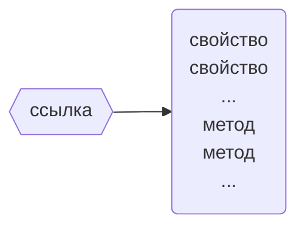
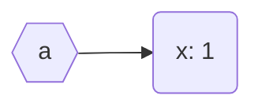
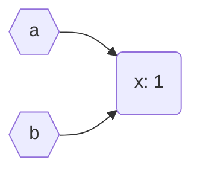
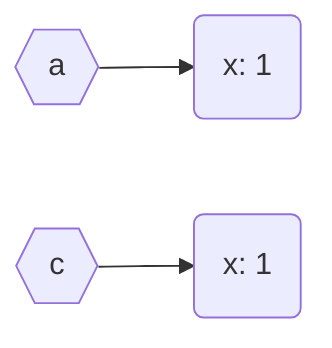
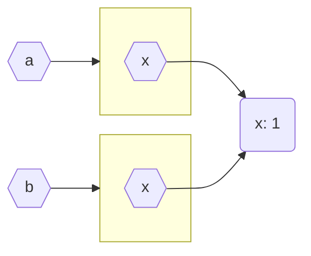

# Объекты и их типизация в typescript

---

# Что рассматривается

- Понятие объекта, ссылки на объект и типы объекта и ссылки
- Создание, копирование, сравнение объектов на этапе исполнения
- Контроль типов на этапе компиляции 

# Что будет позже

- Методы создания объектов в программе (классы и др.)

---
layout: two-cols-header
---

# Объект и ссылка

::left::



::right::

```ts {monaco}
const a = {
    "x": 1
}
```



---

# Тип ссылки

```ts {monaco}
const a: { "x": number } = { 
    "x": 1 
}
const b = { 
    "x": 1 
}
type A = { "x": 1 }
const c: A = { 
    "x": 1 
}
a.x = 2
b.x = 2
c.x = 2
```

---

# Типы ссылки и тип объектов

```ts {monaco}
const a = { 
    "x": 1, 
    "y": 2 
}
const b = { 
    "x": 1 
}
type A = { "x": number }
type B = { "x": number, "y": number }

// Принцип подстановки (упрощенная версия)
const c: A = a
const d: A = b
const e: B = a
const g: B = b
```

---
layout: two-cols-header
---

# Копирование ссылки

::left::

```ts {monaco-run}
const a = { "x": 1 }

const b = a // Копирование ссылки

a.x = -1
console.log(a)
console.log(b)
```

::right::



---
layout: two-cols-header
---

# Копирование объекта

::left::

```ts {monaco-run}
const a = { "x": 1 }

const c = Object.assign({}, a)

a.x = -1
console.log(a)
console.log(c)

```

::right::



---

# Копирование массивов

```ts {monaco-run}
const a: number[] = [1, 2, 3]
console.log(Object.assign({}, a))
console.log(a.slice())
console.log(Array.from(a))
console.log([...a])
```

---
layout: two-cols-header
---

# Вложенные объекты

::left::

```ts {monaco-run}
const a = {
    x: { x: 1 }
}
const b = Object.assign({}, a)
a.x.x=-1
console.log(b)
```

::right::



---

# Копирование вложенных объектов

```ts {monaco-run}
const a = {
    x: {
        x: 1
    }
}
const b = Object.assign({}, a)
const c = JSON.parse(JSON.stringify(a)) as typeof a
a.x.x=-1
console.log(b)
console.log(c)
```

---

# Копирование вложенных массивов

```ts {monaco-run}
const a = [ [0, 1], [2]] // [ [[0], [0, 1]], [[2]]]
const b = [...a]
const c = JSON.parse(JSON.stringify(a)) as typeof a
const d = a.map(e => e.slice())
a[0][0] = -1 // a[0][0][0] = -1
console.log(b)
console.log(c)
console.log(d)
```

---

# Сравнение примитивных типов

```ts {monaco-run}
// any - тип, отключающий ts
// использовать только в крайних случаях
const a: any = 0
const b: any = "0"
console.log(a==b, a===b)
```

---

# Сравнение объектов

```ts {monaco-run}
const a = { x: 1}
const b = a
const c = Object.assign({}, a)
const d = { x: 1}
console.log(a==b, a===b)
console.log(a==c, a===c)
console.log(a==d, a===d)
```

---

# Структурное сравнение массивов. Параметры типа (Generic)

```ts {monaco-run}
// T - параметр типа, вся функция - generic
function array_equals<T>(a: T[], b: T[]): boolean {
    if (a.length != b.length) return false    
    for (let i = 0; i < a.length; i++)
        if (a[i] !== b[i])
            return false
    return true
}

const a = [1, 2, 3]
console.log(array_equals<number>(a, [1, 2, 3]))
console.log(array_equals(a, [1, 2]))
console.log(array_equals(["a", "b", "c"], ["a", "b", "c"]))
```

