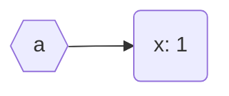
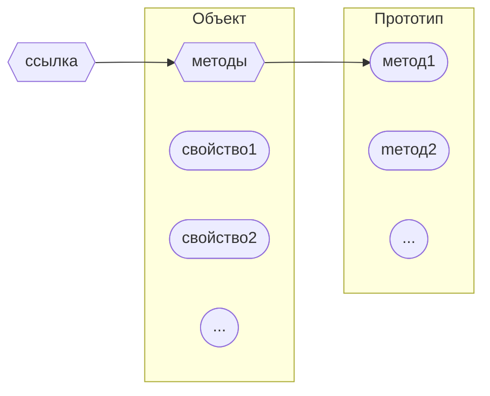
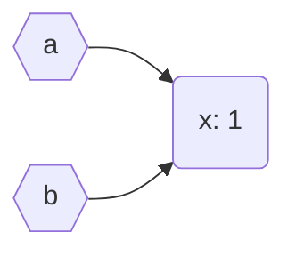
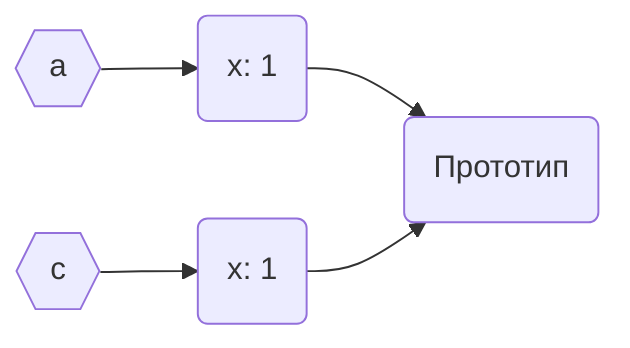
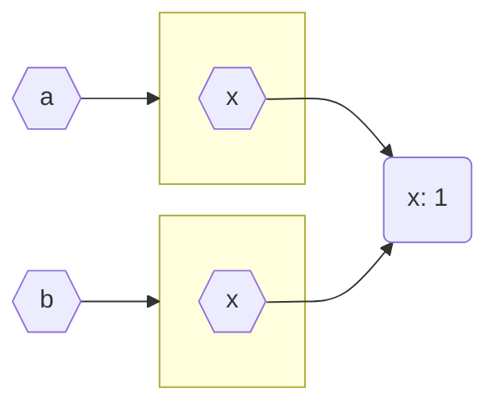

# Объекты и их типизация в typescript

---

# Что рассматривается

- Понятие объекта, ссылки на объект и типы объекта и ссылки
- Создание, копирование, сравнение объектов на этапе исполнения
- Контроль типов на этапе компиляции 

# Что будет позже

- Проектирование объектов в программе (классы и др.)

---

# Объект и ссылка

<div class="grid grid-cols-2 gap-4">
  <div>
```ts {monaco}
const a = {
    "x": 1
}
```
  </div>
  <div class="flex justify-center">

  </div>
</div>

---

# Объект и ссылка

<div class="flex justify-center">

</div>

---

# Тип ссылки

```ts {monaco}
const a: { "x": number } = { 
    "x": 1 
}
const b = { 
    "x": 1 
}
type A = { "x": 1 }
const c: A = { 
    "x": 1 
}
a.x = 2
b.x = 2
c.x = 2
```

---

# Типы ссылки и тип объектов

```ts {monaco}
const a = { 
    "x": 1, 
    "y": 2 
}
const b = { 
    "x": 1 
}
type A = { "x": number }
type B = { "x": number, "y": number }

// Принцип подстановки (упрощенная версия)
const c: A = a
const d: A = b
const e: B = a
const g: B = b
```

---

# Копирование ссылки

<div class="grid grid-cols-2 gap-4">
  <div>
```ts {monaco-run}
const a = { "x": 1 }

const b = a // Копирование ссылки

a.x = -1
console.log(a)
console.log(b)
```
</div>
<div class="flex justify-center">

  </div>
</div>


---

# Копирование объекта

Хорошо спроектированные объекты имеют свой метод копирования!

<div class="grid grid-cols-2 gap-4">
  <div>
```ts {monaco-run}
const a = { "x": 1 }

// Копирует любые объекты
const c = Object.assign({}, a)

a.x = -1
console.log(a)
console.log(c)
```
  </div>
  <div class="flex justify-center">

  </div>
</div>

---

# Копирование массивов

```ts {monaco-run}
const a: number[] = [1, 2, 3]
console.log(Object.assign({}, a))
console.log(a.slice())
console.log(Array.from(a))
console.log([...a])
```

---

# Вложенные объекты

<div class="grid grid-cols-2 gap-4">
  <div>
```ts {monaco-run}
const a = {
    x: { x: 1 }
}
const b = Object.assign({}, a)
a.x.x=-1
console.log(b)
```
  </div>
  <div class="flex justify-center">

  </div>
</div>

---

# Копирование вложенных объектов

```ts {monaco-run}
const a = {
    x: {
        x: 1
    }
}
const b = Object.assign({}, a)
const c = JSON.parse(JSON.stringify(a)) as typeof a
a.x.x=-1
console.log(b)
console.log(c)
```

---

# Копирование вложенных массивов

```ts {monaco-run}
const a = [ [0, 1], [2]] // [ [[0], [0, 1]], [[2]]]
const b = [...a]
const c = JSON.parse(JSON.stringify(a)) as typeof a
const d = a.map(e => e.slice())
a[0][0] = -1 // a[0][0][0] = -1
console.log(b)
console.log(c)
console.log(d)
```

---

# Сравнение примитивных типов

```ts {monaco-run}
// any - тип, отключающий ts
// использовать только в крайних случаях
const a: any = 0
const b: any = "0"
console.log(a==b, a===b)
```

---

# Сравнение объектов

```ts {monaco-run}
const a = { x: 1}
const b = a
const c = Object.assign({}, a)
const d = { x: 1}
console.log(a==b, a===b)
console.log(a==c, a===c)
console.log(a==d, a===d)
```

---

# Структурное сравнение массивов. Параметры типа (Generic)

```ts {monaco-run}
// T - параметр типа, вся функция - generic
function array_equals<T>(a: T[], b: T[]): boolean {
    if (a.length != b.length) return false    
    for (let i = 0; i < a.length; i++)
        if (a[i] !== b[i])
            return false
    return true
}

const a = [1, 2, 3]
console.log(array_equals<number>(a, [1, 2, 3]))
console.log(array_equals(a, [1, 2]))
console.log(array_equals(["a", "b", "c"], ["a", "b", "c"]))
```

---

# Глубокое сравнение объектов

```ts {monaco-run}
import deepEqual from "deep-equal"

const a = { x: { x: 1 } }
const b = { x: { x: 1 } }
console.log(deepEqual(a, b))
console.log(JSON.stringify(a) == JSON.stringify(b))
    
const c = { x: { y: 2, x: 1 } }
const d = { x: { x: 1, y: 2 } }
console.log(deepEqual(c, d))
console.log(JSON.stringify(c) == JSON.stringify(d))
```

---

# Методы объектов и функции

<div class="grid grid-cols-2 gap-4">
  <div>
```ts {monaco-run}
const y = {
    "x": 1,
    "inc": function () {
        this.x += 1
    }
}
y.inc()
console.log(y)
```
  </div>
  <div>
```ts {monaco-run}
type A = { x: number }
const x = { x: 1 }
function inc(a: A): A {
    a.x += 1
    return a
}
inc(x)
console.log(x)
```
  </div>
</div>


---

# Указатель this


---

# Потеря контекста this

```ts {monaco-run}
const y = { 
    x: 1, 
    inc: function () {
        this.x += 1
    }
}
const z = y.inc
z()
console.log(y)
```

---

# Привязка this

```ts {monaco-run}
const a = {
    "x": 0,
    inc(step: number){
        this.x += step
        return this.x
    }
}
const b = {"x": 10}

const inc = a.inc
const inc_b = inc.bind(b)
console.log(inc_b(3))
console.log(inc.apply(b, [5]))
console.log(inc.call(b, 7))
```

---

# Методы и стрелочные функции

```ts {monaco}
const y = {
    "x": 1,
    "inc": () => {
        this.x += 1
    }
}
```
TS7041: The containing arrow function captures the global value of 'this'.

---

# Описание типа. Необязательные свойства

```ts {monaco-run}
type A = {
    "x": number,
    "y"?: number
}
function sum_props(a: A): number {
    return a.x + (a.y ?? 0)
}

const a: A = { "x": 1 }
const b: A = { "x": 1, "y": 2 }
console.log(sum_props(a))
console.log(sum_props(b))
```

---

# Описание типа. Cвойства только для чтения

```ts {monaco-run}
type A = {
    readonly "x": number,
    readonly "y": number
}
function sum_props(a: A): number {
    a.x += a.y
    return a.x
}

const a: A = { "x": 1, "y": 2 }
console.log(sum_props(a))
```

---

# Простые операции над типами

```ts {monaco-run}
const x: { "x": number } = { "x": 1 }
const y: { "y": number } = { "y": 2 }
const a = Object.assign(x, y)
type A = typeof x & typeof y    // TS

function len(x: number | string): number {
    if (typeof x === "number")  // JS
         x = x.toString()
    return x.length
}
console.log(len(123))
console.log(len("12"))
```

